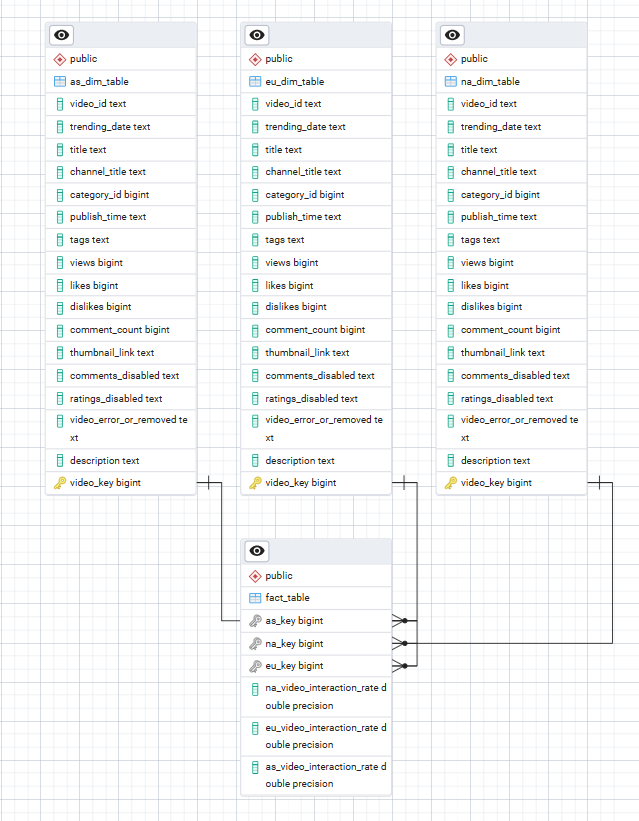

# 📊 End-to-End Automated Data Pipeline (YouTube Data Analysis)

This project demonstrates a fully automated data pipeline for analyzing YouTube data using an ETL (Extract, Transform, Load) workflow. The pipeline leverages **Python**, **PostgreSQL**, **Docker**, and **Prefect** for data extraction, cleaning, transformation, and loading into a database for further analysis.

## 🛠️ Technology Stack
- **Programming Language**: Python
- **Database**: PostgreSQL (via Docker)
- **Workflow Orchestration**: Prefect
- **Data Source**: Kaggle Dataset

## 🔄 Workflow Overview
The workflow is divided into three main phases of the ETL process:

### 1. Extract
- **Data Source**: Data is extracted from a Kaggle dataset (link to dataset can be added here).
- **Storage**: Extracted data is stored locally in a folder for further processing.

### 2. Transform
- **Data Cleaning**: The extracted data undergoes cleaning to:
  - Handle null values
  - Remove empty or irrelevant data
- **Dimension Table Creation**: The cleaned data is divided into three dimension tables based on regions:
  - Asia
  - Europe
  - North America
- **Fact Table Construction**:
  - A fact table is created as a bridge table linking all the dimension tables using surrogate keys.
  - New columns are introduced to provide insights into the most interacted videos in each region:
    - `eu_interaction_rate`: Interaction rate for Europe
    - `na_interaction_rate`: Interaction rate for North America
    - `as_interaction_rate`: Interaction rate for Asia
  - These interaction rates are calculated based on views, likes, dislikes, and comment counts.

### 3. Load
- **Database Integration**: The cleaned and transformed dataset is loaded into a PostgreSQL database hosted in a Docker container.
- **Automation**: The entire ETL process is automated using **Prefect**, ensuring scalability and fault tolerance.
  
## Snapshot of Result Data

